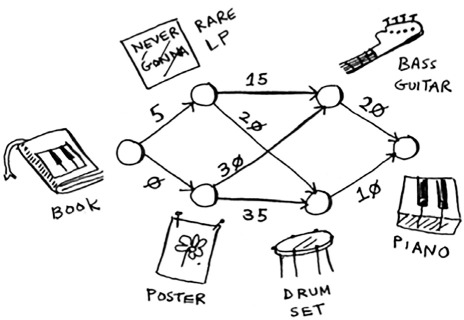

# Grokking Algorithms  

## Chapter 1 : Introduction to Algorithms  
*Page 1-19*

Algorithms is a set of instructions for accomplishing a task. Every 
piece of code could be called an algorithm. We learn about the fast 
or the ones that proved solving interesting problems.

### Binary Search  
It is an algorithm that takes in a sorted list of elements. If an 
element you're looking for is in that list, binary search returns 
tbe position where it's located, Otherwise binary search returns 
null.

Suppose you are searching for a word in dictionary. The dictionary 
has 240,000 words. In worst case, simple search could take 240,000 
steps. In binary search you go to the middle of the dictionary 
if that's not it (if it's before this point), you go to the first 
middle's middle, then you repeat each time you eliminate half of 
the problem.

So binary search will take 18 steps in worst case.

### Big O Notation  
It tells you how fast an algorithm is. Not in seconds though. 
But it tells you how fast the algorithm grow as the input size 
grows.

Big O establishes worst case runtime.

Common Big O runtimes  
- O(log n) *Logarithmic*  
- O(n) *Linear*  
- O(n log n)  
- O(n^2) *Quadratic*  
- O(n!) *Fractional*  

So algorithms isn't measured in seconds, but in growth of the 
number of operations. Instead, we talk about how quickly the 
runtime of an algorithm increases as the size of the input 
increases.

---

## Chapter 2 : Selection Sort  
*Page 21-36*

### Arrays and Linked Lists  
**Arrays** store elements in a sequential positions somewhere in the 
memory. whenever you want to add a new element, you'll have to 
create a new array to hold all the elements as the next sequential 
position would have been taken.

**Linked Lists** store elements in different positions in the memory. 
Each element holds an address to the next element. So it's easy 
to add elements to a list. But not easy to find ode.

|   |Arrays|Linked Lists|
|---|---|---|
|Reading|O(1)|O(n)|
|Inserting|O(n)|O(1)|
|Deleting|O(n)|O(1)|

- O(1) *Constant*

#### Types of Access  
Random (Arrays) :  
Jump directly to the "n"th element.

Sequential (Linked Lists) :  
Reading the elements one by one, starting at the first element.

### Selection Sort  
In selection sort you iterate over the entire array `n` times to 
find the smallest element in each iteration.

So it takes `O(n^2)` to sort the array.

* Remember constants in Big O is ignored, you might say that each 
iteration you go over less elements `(n-1)`. While that's true, yet
Big O ignores constants.

### Example : 
```java
public ArrayList<Integer> sort(ArrayList<Integer> array) {
    ArrayList<Integer> sortedArr = new ArrayList<>();
    int arrayLength = array.size();
    for(int i = 0; i < arrayLength; i++) {
        int smallestIndex = findSmallest(array);
        sortedArr.add(array.remove(smallestIndex));
    }
    return sortedArr;
}

private int findSmallest(ArrayList<Integer> arr) {
    int smallest = arr.get(0);
    int smallest_index = 0;
    for(int i = 0; i < arr.size(); i++) {
        if(arr.get(i) < smallest) {
        smallest = arr.get(i);
        smallest_index = i;
       }
    }
    return smallest_index;
}
```

---

## Chapter 3 : Recursion  
*Page 37-50*

### Recursion  
Recursion is when a method calls itself repeatedly until it reaches 
an exit condition and returns.

Many important algorithms use recursion, so it's important to 
understand the concept.

### Base Case and Recursive Case
Every recursive function has two parts: *the base case and the 
recursive case*. The recursive case is when the function calls itself. 
The base case is when the function doesn't call itself again, 
so it doesn't go into an infinite loop.

Consider the following function that calculates a number's factorial : 
```java
public int factorial(int n) {
    if (n == 1) return n;            //base case
    return (n * factorial(n - 1));   //recursive case
}   
```

### The Stack  
The call stack is an important concept in
general programming.  
In Arrays and lists you could add an item anywhere in the list. 
The stack is much simpler. When you add an item, it gets added 
to the top of the list. When you read an item, you read only 
the top most-item, and it's taken off the list. So your stack 
has only two actions, push (add to the end of the list), and 
pop (remove the top-most item and read it).

Your computer uses a stack internally called the call stack.

Let's demonstrate it.
```java
public static void main(String[] args) {
    System.out.println("Hello!");
    greatUser("User");
    System.out.println("Welcome!");
}
```

In the above example, the main function gets called. Your computer 
allocates a box of memory for the main function. If there's a variable 
the variable gets saved in memory. Every time you make a function call,
your computer saves the values for all the variables for that
call in memory. Next the `greatUser(userName)` function gets called, 
so your computer allocates memory for that function. Using a stack 
of memory boxes the recently called function's memory box gets 
*pushed* on top of that stack. When the function is done and hits 
the `return` statement that box (top-most) gets popped off the stack 
and then the top-most becomes the box becomes the function that called 
the one we just popped off.


---

## Chapter 4 : Quick Sort  
*Page 51-72*

### Divide and Conquer  
Suppose you're a farmer with a plot of land.  
The land is **1680** Meters wide and the height is **640** Meters.
You want to divide this farm evenly into *square* plots. You want
the plots to be as big as possible.

How to figure out the largest size you can use for a plot of land? 
Use D&C.  
To solve the problem using D&C there are two steps :  
1- Figure out the base case. This should be the simplest possible 
case.  
2- Divide and decrease your problem until it becomes the base case.  

Let’s use D&C to find the solution to this problem. What is the largest
square size you can use?  
First, figure out the base case. The easiest case would be if one side was
a multiple of the other side.  
Suppose one side is 25 meters (m) and the other side is 50 m. Then the
largest box you can use is 25 m × 25 m. You need two of those boxes to
divide up the land.  

Now you need to figure out the recursive case. This is where D&C
comes in. According to D&C, with every recursive call, you have to
reduce your problem. How do you reduce the problem here? Let’s start
by marking out the biggest boxes you can use.

You can fit two 640 * 640 boxes here, and there's some land 
still left to divide. There’s a farm segment left to divide.
Why don’t you apply the same algorithm to this segment?  
You have 400 * 640 left.

So you started out with a 1680 × 640 farm that needed to be split up.
But now you need to split up a smaller segment, 640 × 400. If you find
the biggest box that will work for this size, that will be the biggest box
that will work for the entire farm. You just reduced the problem from
a 1680 × 640 farm to a 640 × 400 farm!

####Euclid’s Algorithm  
“If you find the biggest box that will work for this size,
that will be the biggest box that will work for the entire farm.”

Let’s apply the same algorithm again. Starting
with a 640 × 400 m farm, the biggest box you
can create is 400 × 400 m.

And that leaves you with a smaller segment, 400 × 240 m.
And you can draw a box on that to get an even smaller segment,
240 × 160 m. And then you draw a box on that to get an even 
smaller segment. Hey, you’re at the base case: 80 is a factor
of 160. If you split up this segment using boxes, you don’t 
have anything left over!

So, for the original farm, the biggest plot size you can 
use is 80 × 80 m.

To recap, here’s how D&C works :  
1. Figure out a simple case as the base case.  
2. Figure out how to reduce your problem and 
get to the base case.

Example of a function that calculates the sum of a list of 
numbers.  
The base case is `if the list is empty return 0`.  
Let's reduce the problem to reach the base case. First we 
check if the list is empty (base case). If not we return 
the first element of the array plus the sum of the rest of 
the array. We recursively repeat that until we hit the base 
case.

```java
public int sum(List<Integer> list) {
    if (list.isEmpty()) return 0;
    return list.get(0) + sum(list.subList(1, list.size()));
}
```

### Quick Sort  
Quick sort is a sorting algorithm that's much faster than selection 
sort and is frequently used in real life.  

Let's use it to sort an array. What is the simplest array 
a sorting algorithm can sort? Empty arrays and arrays that 
have one element. So that's our base case (we can return them
as is).  

Here's how quick sort works.  
Find an element from the array, we will call it *pivot*. 
Will see later how to choose good pivot but for now let's 
pick the first element in the array `[33, 15, 10] -> pivot 
is 33`. Now find the elements smaller than the pivot and 
the elements larger than the pivot. This is called partitioning. 

Now you have  
- A sub array of all elements smaller than the pivot.  
- The pivot.  
- A sub array of all elements larger than the pivot.  

The two sub-arrays aren't sorted they are just partitioned.
But if they were sorted, then sorting the whole array would 
be pretty easy. You would then combine the whole thing like
`left array + pivot + right array` and you get a sorted
array.

How do you sort the sub-arrays? If you call quicksort on the two
sub-arrays and then combine the results, you get a sorted array! 
`quicksort([15, 10]) + [33] + quicksort([])`. This will work with 
any pivot.  

Here are the steps :  
1- Pick a pivot.  
2- Partition the array into two sub-arrays: elements less than 
the pivot and elements greater than the pivot.  
3- Call quicksort recursively on the two sub-arrays.  

Here's a code example for quick sort :  
```java
public List<Integer> sort(List<Integer> list) {
    if (list.size() < 2) {
        return list;
    }

    int pivot = list.remove(0);
    List<Integer> smallerThanPivotList = new ArrayList<>();
    List<Integer> greaterThanPivotList = new ArrayList<>();

    for (int element : list) {
        if (element <= pivot) smallerThanPivotList.add(element);
        else greaterThanPivotList.add(element);
    }

    List<Integer> sortedList = Stream.of(sort(smallerThanPivotList), List.of(pivot), sort(greaterThanPivotList))
            .flatMap(Collection::stream)
            .collect(Collectors.toList());

    return sortedList;
}
```

### Big O Notation Revisited  
Quicksort is unique because its speed depends on the pivot 
you choose.

There’s another sorting algorithm called merge sort, which is
O(n log n). Quicksort is a tricky case. In the worst case, 
quicksort takes O(n2) time.

It’s as slow as selection sort! But that’s the worst case. 
In the average case, quicksort takes O(n log n) time. 
So you might be wondering :  
- What do *worst case* and *average case* mean here?  
- If quicksort is O(n log n) on average, but merge sort 
is O(n log n)always, why not use merge sort? Isn’t it faster?  

#### Merge sort vs Quick Sort  
In Big O notation we know that it ignores the constants.
But sometimes the constant can make a difference. Quicksort 
versus merge sort is one example. Quicksort has a smaller 
constant than merge sort. So if they’re both O(n log n) time, 
quicksort is faster. And quicksort is faster in practice 
because it hits the average case way more often than the 
worst case.

So now you’re wondering: what’s the average case versus 
the worst case?

#### Average Case vs Worst Case  
The performance of quicksort heavily depends on the pivot you choose.
Suppose you always choose the first element as the pivot. And you
call quicksort with an array that is already sorted. Quicksort doesn't
check to see whether the input array is already sorted. So it will still try
to sort it.

We’re not splitting the array into two halves. Instead, one
of the sub-arrays is always empty. So the call stack is really long. 
Now instead, suppose you always picked the middle element as the 
pivot.

The first example you saw is the worst-case scenario, and the second
example is the best-case scenario. In the worst case, the stack size is
O(n). In the best case, the stack size is O(log n).

If you always choose a random element in the array as the
pivot, quicksort will complete in O(n log n) time on average. Quicksort
is one of the fastest sorting algorithms out there, and it’s a very good
example of D&C.

So if we alter our quick sort example from before we will change only 
one line :  
```java
//int pivot = list.remove(0);
int pivot = list.remove(list.size() / 2);
```

---

## Chapter 5 : Hash Tables  
*Page 73-94*

Suppose you have a menu, your menu is an array of items, each 
item contains a name, and a price `[(Apple, 3), (Orange, 2.75)]`. 
Now you want to search for an item in the array. If the array 
is unsorted you will have to use simple search and go through 
every item in the array to find your item. If the array is 
sorted you can use binary search. Simple search as we know 
takes O(n), while binary search takes O(log n). But what 
if you have someone that memorizes all the items in the array.
You can just ask him / her about the item and she / he will 
reply instantly. That will take O(1). Which is instant.
That’s where hash functions come in.

### Hash Functions  
A hash function is a function where you put a string (string here 
means any kind of data - a sequence of bytes) and you get back 
a number.

In technical terminology, we'd say that a hash function maps 
strings to numbers. There are some requirement to hash function :  
- It needs to be consistent. For example, suppose you put in "Apple" 
and get back 4. Every time you put in "Apple", you should get 4 back. 
Without this your hash table won't work.  
- It should map different words to different numbers. For example, 
a hash function is no good if it always returns 1 for any word 
you put in. In the best case every word should map to a different 
number.

So what does a hash function good for? Well, you can use it to make 
yourself that "someone" that memorizes everything.

Start up with an empty array. You will store all of your 
prices in the array. Let's add the price of an apple. Put 
"Apple" into the hash function. The hash function outputs 3.
So let's store the price of an apple at index 3 in the array. 
Let's put "Milk" into the hash function. The hash function 
returns 0. Let's store the price of milk at index 0. Keep 
going, and eventually the whole array will be full of prices.

Now if you want to know what's the price of an avocado. You don't 
have to search for it. You just put "Avocado" into the hash function, 
and it tells you that the price of an avocado is stored at index 
4 in the array.

The hash function tells you exactly where the price is stored, so you
don’t have to search at all! This works because :  
- The hash function consistently maps a name to the same index. Every
time you put in "Avocado", you’ll get the same number back. So you
can use it the first time to find where to store the price of an avocado,
and then you can use it to find where you stored that price.  
- The hash function maps different strings to different indexes.
"Avocado" maps to index 4. "Milk" maps to index 0. Everything maps
to a different slot in the array where you can store its price.  
- The hash function knows how big your array is and only returns valid
indexes. So if your array is 5 items, the hash function doesn't return
100 … that wouldn't be a valid index in the array.

### Collisions  
Most languages have hash tables. You don't need to know how to 
write your own. But to understand the performance of hash tables, 
you first need to understand what collisions are.

First, I've been telling you a white lie. I told you that a 
hash function always maps different keys to different slots 
in the array.

In reality, it's almost impossible to write a hash function 
that does this. Let's take a simple example. Suppose your 
array contains 26 slots. And your hash function is really 
simple: it assigns a spot in the array alphabetically.
Now you want to store the price of "Apple" in the hash, you get 
assigned the first slot. Then you want ot store the price of 
"Avocado" in the hash, you get assigned the first slot again. 
This is called a *collision :* two keys have been assigned in 
the same slot. This is a problem. If you store the price of 
avocados at that slot, you'll overwrite the price of apples.

Collisions are bad, and you need to work around them. There 
are many ways to deal with collisions. The simplest one is 
if multiple keys map to the same slot, start a linked list 
at that slot.

If you then want to search for the price of "Apple", 
you have to go to the first slot and search the linked 
list to find it. If the linked list is small, no big deal. 
But suppose all of your items start with "a". The entire hash 
table will be empty except of one slot. And that slot has a 
giant linked list. Every single element in the hash table is 
in that linked list. That's as bad as putting everything in a 
linked list to begin with. It's going to slow down your hash 
table.

There are two things to consider here :  
- Your hash function is really important. Your hash function 
mapped all the keys to a single slot. Ideally, your hash function 
would map keys evenly all over the hash.  
- If those linked lists get long, it slows down your hash 
table a lot. But they won't get long if you use a good hash 
function!

The hash function is very important. How do you choose a good 
hash function. That's in the next section.

### Performance  
In average case, hash tables take O(1) for everything (search, 
insert, delete). O(1) is called constant time. It doesn't mean 
instant. It means the time taken will stay the same, regardless 
of how big the hash table is.

In the worst case, a hash table takes O(n) for everything,
which is really slow. 

Let's compare hash tables to Arrays and lists.

|   |Hash Tables (Average)|Hash Tables (Worst)| Arrays|Linked Lists|
|---|---|---|---|---|
|Reading|O(1)|O(n)|O(1)|O(n)|
|Inserting|O(1)|O(n)|O(n)|O(1)|
|Deleting|O(1)|O(n)|O(n)|O(1)|

It's important that you don't hit the worst-case performance 
with hash tables. And to do that, you need to avoid collisions. 
To avoid collisions, you need :  
- A low loader factor.
- A good hash function.

#### Load Factor  
The load factor of a hash table is easy to calculate `Number of 
items in the hash table / Total number of slot`.

Hash tables use an array for storage, so you count the number of
occupied slots in an array. For example, this hash table has a 
load factor of 2/5, or 0.4.  
`[empty, 1, empty, 0, empty]`.

Load factor measures how many empty slots remain in your 
hash table.

Suppose you need to store the price of 100 produce items in 
your hash table, and your hash table has 100 slots. In the 
best case, each item will get its own slot.

Having a load factor greater than 1 means you have more items 
than slots in your array. 

Once the load factor starts to grow, you need to add more 
slots to your hash table. This is called resizing. With a 
lower load factor, you'll have fewer collisions, and your 
table will perform better. A good rule is, resize when your 
load factor is greater than 0.7.

Resizing is expensive, and you don't want to resize too often. 
But averaged out, hash tables take O(1) even with resizing.

#### A Good Hash Function  
A good hash function distributes values in the array evenly.
A bad hash function groups values together and produces a 
lot of collisions.

What is a good hash function? That's something you'll never 
have to worry about. If you're really curious, look up the SHA 
function (there's a short description of it in the last chapter). 
You could use that as your hash function.

---

## Chapter 6 : Breadth-First Search  
*Page 95-114*

Breadth-first search allows you to find the shortest distance
between two things. Graph algorithms are some of the most 
useful algorithms I know. Make sure you read the next few 
chapters carefully. These are algorithms you’ll be able to 
apply again and again.

### Introduction to Graphs  
Suppose you want to move from a point to another. There isn't 
direct connection between the two. There are some steps or points 
in between. So you want to find the shortest path to move from 
a point to another. This type of problem is called a shortest-path
problem. The algorithm to solve a shortest-path problem is 
called breadth-first search.

To figure out how to get from point `A` to point `B` there are 
two steps :  
1- Model the problem as graph.  
2- Solve the problem using breadth-first search.

### What is a Graph?  
A graph models a set of connections. Each graph is made up of 
nodes and edges.
```text
(Node) ----Edge---- (Node)
```

A node can be directly connected to many other nodes. 
Those nodes are called its neighbors. Graphs are a way to 
model how different things are connected to one another.

### Breadth-First Search  
We already know Binary search. Breadth-first search is a different 
kind of search algorithm, one that runs on graphs. It can answer 
two types of questions :  
1- Is there a path from node `A` to node `B`?  
2- What is the shortest path from node `A` to node `B`?  

#### Finding the Shortest Path  
To find the shortest path from point `A` to point `B`, you need 
to look at every point in the first-degree connections to see if 
that is the point you want before searching any second-degree 
connections. Breadth-first search does this. The way it works 
is that it radiates out from the starting point. So it will check 
first-degree connections before second-degree connections. 
Breadth-first search not only finds a path from `A` to `B`, 
it also finds the shortest path.

Another way to see this is, first-degree connections are added 
to the search list before second-degree connections. So this 
only works if you search nodes (points) in the same order in 
which they're added. What happens if you search second-degree 
before first-degree connections? You end up with a node (point) 
that isn't the closest to you in the graph. So you need to search 
people in the order that they're added. There's a data structure 
for this, it's called a *queue*.

#### Queues  
A queue works exactly like it does in real life. Queues are 
similar to stacks. You can't access random elements in the queue. 
Instead, there are only two operations, enqueue and dequeue.

If you enqueue two items to the list, the first item you added 
will be dequeued before the second item. You can use this for 
your search list! People who are added to the list first will 
be dequeued and searched first.

The queue is called a FIFO data structure, First In, First Out. 
In contrast, a stack is a LIFO data structure, Last In, 
First Out.

### Implementing the Graph  
First, you need to implement the graph in code. A graph consists 
of several nodes. And each node is connected to neighboring nodes.
How do you express a relationship like `you -> bob`?
Luckily, you know a data structure that lets you express
relationships, a hash table!

Remember, a hash table allows you to map a key to a value. 
In this case, you want to map a node to all of its neighbors.

Here's how you'd write it in Java :  
```java
var graph = new HashMap<String, List<String>>();
var firstDegreeConnections = Arrays.asList("Omar", "Sarah", "Aya");
graph.put("You", firstDegreeConnections);
```
- *In Java we have two implementations for hash tables, 
`Hashtable`, and `HashMap`.*

Notice that `"you"` is mapped to an array. So `graph["you"]` will 
give you an array of all the neighbors of `"you"`.

A graph is just a bunch of nodes and edges, so this is all you need to
have a graph in Java. What about a bigger graph?

```java
var graph = new HashMap<String, List<String>>();
var yourConnections = Arrays.asList("Omar", "Sarah", "Aya");
var ayaConnections = Arrays.asList("Ahmed", "Omar");
var ahmedConnections = Arrays.asList("Yara");
var omarConnections = Arrays.asList();
graph.put("You", yourConnections);
graph.put("Aya", ayaConnections);
graph.put("Ahmed", ahmedConnections);
graph.put("Omar", omarConnections);
```

Does it matter what order you add the key/value pairs in?
Does it matter if you write :  
```java
var ahmedConnections = Arrays.asList("Yara");
var omarConnections = Arrays.asList();
graph.put("Ahmed", ahmedConnections);
graph.put("Omar", omarConnections);
```

Instead of :  
```java
var ahmedConnections = Arrays.asList("Yara");
var omarConnections = Arrays.asList();
graph.put("Omar", omarConnections);
graph.put("Ahmed", ahmedConnections);
```

Well it doesn't. Hash tables have no ordering, so it doesn't 
matter what order you add key/value pairs in.

`Omar` has an arrow pointing to him, but from him to someone else. 
This is called a *directed graph*. So `Omar` is `Aya's` neighbor, 
but `Aya` isn't `Omar's` neighbor. An undirected graph doesn't 
have any arrows, and both nodes are each other's neighbors.

### Implementing the Algorithm  
Here's how the implementation will work.  
1- Keep a queue containing the nodes to check.  
2- Pop an item off the queue.  
3- Check if the item matches your criteria.  
4- If yes, that's it. If no, add all the neighbours of that 
item to the queue.  
5- Loop!  
6- If the queue is empty there are no items that match your 
criteria.

Let's implement the algorithm. First we need to create the graph.
```java
var graph = new HashMap<String, List<String>>();
graph.put("You", Arrays.asList("Omar", "Sarah", "Aya"));
graph.put("Aya", Arrays.asList("Ahmed", "Omar"));
graph.put("Ahmed", Arrays.asList("Yara"));
graph.put("Omar", Arrays.asList());
```
Now let's create a queue.
```java
var queue = new LinkedList<String>();
queue.addAll(graph.get("You"));
```
- *A LinkedList in Java can be used as a queue data structure
as it implements the `Deque` interface which extends the `Queue`
interface.*

Remember that `graph.get("You")` will return a list of all of 
your neighbours. And we add them to the search queue.

Next we will keep track of the people we already searched.
```java
var searched = new ArrayList<>();
```
This is used to prevent looking for the same person twice and 
also without this we could end up in an infinite loop (If your 
connection is Adam and Adam's connection is you, and that's all 
in the graph, so you could end up in an infinite loop).

Let's see the rest.
```java
while (!queue.isEmpty()) {
    var person = queue.remove();
    var found = searched.stream().filter(p -> p.equals(person)).findFirst();
    if (found.isEmpty()) {
        if (person.equals("Ahmed")) { //just a dummy search criteria for demonstration
            System.out.println(person + " is found");
            break;
        }
        else {
            var c = graph.get(person);
            if (c != null) queue.addAll(c);
            searched.add(person);
        }
    }
}
```

#### Running Time  
If you search your entire network for some criteria, that means you'll
follow each edge (remember, an edge is the arrow or connection from
one person to another). So the running time is at least O(number of
edges).
You also keep a queue of every person to search. Adding one person to
the queue takes constant time: O(1). Doing this for every person will
take O(number of people) total. Breadth-first search takes O(number of
people + number of edges), and it's more commonly written as O(V+E)
(V for number of vertices, E for number of edges).

Suppose you have a family tree. You, your parents, and your 
grandparents. Suppose you have a family tree.
This is a graph, because you have nodes (the people) and edges.
The edges point to the nodes' parents. But all the edges go down—it
wouldn't make sense for a family tree to have an edge pointing 
back up!That would be meaningless—your dad can't be your 
grandfather’s dad!A tree is a special type of graph, 
where no edges ever point back.

This is called a tree. A tree is a special type of graph, where no edges
ever point back.

---

## Chapter 7 : Dijkstra's Algorithm
*Page 115-140*

In the previous chapter we saw graph and used breadth-first 
algorithm to find the shortest path from point `A` to point 
`F`. But suppose we add travel time from any point to another.
Now you see that the shortest path we found using breadth-first 
is not the fastest path. How do we get the fastest path? the 
answer is Dijkstra's algorithm.

### Working with Dijkstra's Algorithm  
Each segment has a travel time in minutes. You'll use 
Dijkstra's algorithm to go from start to finish in the 
shortest possible time.

There are four steps to Dijkstra's algorithm :  
1- Find the "cheapest" node. This is the node that you 
can get to in the least amount of time.  
2- Update the costs of the neighbors of this node. So that if 
from the starting point to node `A` would take 5 minutes, but 
now that you are at node `B` which took you 3 minutes to get 
from the starting point, and you can get to node `A` from node 
`B` in one minute. Then update that from the start to node `A` 
there's a faster path that takes 4 minutes.  
3- Repeat until you have done this for every node in the graph.  
4- Calculate the final path.

### Terminology  
When you work with Dijkstra's algorithm, each edge in the graph 
has a number associated with it. These are called *weights*.

```text
    7 minutes
A ------------- P
```

A graph with weights is called a *weighted graph*. A graph without 
weights is called *unweighted graph*.

Graphs can also have cycles. It means you can start at a node, 
travel around, and end up at the same node. cycles add more 
weight.

Remember our talk earlier about directed and undirected graphs? 
An undirected graph means that both nodes point to each other. 
That's a cycle! Dijkstra's algorithm only works with directed 
graphs, called DAGs for short.

### Trading for a Piano  
Let's see an example. Our friend Rama, is trying to trade a music 
book for a piano. Perfect! With a little bit of money, Rama 
can trade his way from a piano book to a real piano. Now he 
just needs to figure out how to spend the least amount of money 
to make those trades. Let's graph out what he's been offered.



In this graph, the nodes are all the items Rama can trade for. The
weights on the edges are the amount of money he would have to pay
to make the trade. How is Rama going to figure out the path from 
the book to the piano where he spends the least amount of money? 
We will apply Dijkstra's algorithm's four steps.

Before you start, you need some setup. Make a table of the cost 
for each node. The cost of a node is how expensive it is to 
get to.

|Parent|Node|Cost|
|---|---|---|
|Book|LP|5$|
|Book|Poster|0|
|______|Guitar|∞|
|______|Drums|∞|
|______|Piano|∞|

We will also keep track of the parent node to calculate the path 
in the end.

#### Step 1  
Find the cheapest node you can get to. In this case the poster 
is the cheapest trade at 0$. Is there a cheaper way to trade for 
the poster? Answer is no. Because the poster is the cheapest node 
Rama can get to, and there's no way to make it any cheaper. 

This is the key idea behind Dijkstra's algorithm : Look at the 
cheapest node on your graph. Make sure there is no cheaper way 
to get to this node.

#### Step 2  
Figure out how long it takes to get to its neighbors (the cost).

|Parent|Node|Cost|
|---|---|---|
|Book|LP|5$|
|Book|Poster|0|
|Poster|Guitar|30$|
|Poster|Drums|35$|
|______|Piano|∞|

Figure out how long it takes to get to its neighbors (the cost).
You have prices for the bass guitar and the drum set in the table. 
Their value was set when you went through the poster, so the 
poster gets set as their parent. That means, to get to the bass 
guitar, you follow the edge from the poster, and the same for 
the drums.

#### Step 1 Again  
The LP is the next cheapest node at $5.

#### Step 2 Again  
Update the values of all of its neighbors.

|Parent|Node|Cost|
|---|---|---|
|Book|LP|5$|
|Book|Poster|0|
|LP|Guitar|20$|
|LP|Drums|25$|
|______|Piano|∞|

Hey, you updated the price of both the drums and the guitar! 
That means it's cheaper to get to the drums and guitar by 
following the edge from the LP. So you set the LP as the new 
parent for both instruments.

The bass guitar is the next cheapest item. Update its neighbors.

|Parent|Node|Cost|
|---|---|---|
|Book|LP|5$|
|Book|Poster|0|
|LP|Guitar|20$|
|LP|Drums|25$|
|Guitar|Piano|40$|

Ok, you finally have a price for the piano, by trading the guitar 
for the piano. So you set the guitar as the parent. Finally, 
the last node, the drum set.

|Parent|Node|Cost|
|---|---|---|
|Book|LP|5$|
|Book|Poster|0|
|LP|Guitar|20$|
|LP|Drums|25$|
|Drums|Piano|35$|

Rama can get the piano even cheaper by trading the drum set for 
the piano instead. So the cheapest set of trades will cost 
Rama $35.

So far, you know that the shortest path costs $35, but how do 
you figure out the path? To start with, look at the parent for 
piano.

The piano has drums as its parent. That means Rama trades the drums
for the piano. So you follow this edge.

Let's see how you'd follow the edges. Piano has drums as its parent.
And drums has the LP as its parent. So Rama will trade the LP for 
the drums. And of course, he'll trade the book for the LP. By 
following the parents backward, you now have the complete path.

So far, I've been using the term 'shortest path' pretty literally : 
calculating the shortest path between two locations or between 
two people. I hope this example showed you that the shortest path 
doesn't have to be about physical distance. It can be about 
minimizing something. In this case, Rama wanted to minimize 
the amount of money he spent.

### Negative-Weight Edges  
In the trading example, Alex offered to trade the book for
two items. Suppose Sarah offers to trade the LP for the poster, 
and she'll give Rama an additional $7. It doesn't cost Rama
anything to make this trade; instead, he gets $7 back.

If you run Dijkstra's algorithm on a graph with a negative weight,
Rama will take the wrong path. He'll take the longer path. You 
can't use Dijkstra's algorithm if you have negative-weight edges. 
Negative-weight edges break the algorithm.

If you want to find the shortest path in a graph that has 
negative-weight edges, there's an algorithm for that! It's 
called the Bellman-Ford algorithm.

### Implementation  
